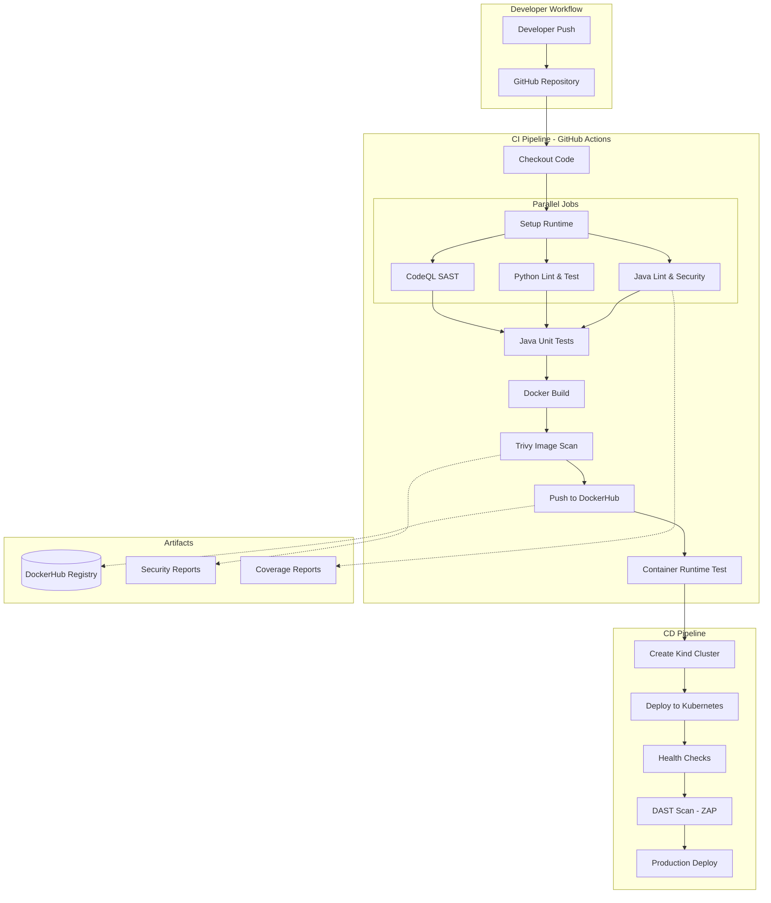

# Algorithmic Portfolio Manager (APM)
## DevOps CI/CD Project Report

**Course:** Software Systems & Technologies (SST)  
**Submission Date:** January 2026  
**Project Repository:** https://github.com/[satish-rathod]/trade-portfolio

---

## Table of Contents
1. [Problem Background & Motivation](#1-problem-background--motivation)
2. [Application Overview](#2-application-overview)
3. [CI/CD Architecture Diagram](#3-cicd-architecture-diagram)
4. [CI/CD Pipeline Design & Stages](#4-cicd-pipeline-design--stages)
5. [Security & Quality Controls](#5-security--quality-controls)
6. [Results & Observations](#6-results--observations)
7. [Limitations & Improvements](#7-limitations--improvements)

---

## 1. Problem Background & Motivation

### 1.1 Industry Challenge
Retail investors and algorithmic traders face significant barriers when building personalized trading dashboards or automated strategies:

| Challenge | Description |
|-----------|-------------|
| **Data Latency** | Free public APIs (AlphaVantage, Yahoo Finance) suffer from severe rate limiting (5 calls/minute) and high latency |
| **Privacy Risks** | SaaS portfolio tools require uploading sensitive financial data to third-party servers |
| **Cost Barrier** | Professional terminals (Bloomberg, Refinitiv) are prohibitively expensive for individual developers |

### 1.2 Proposed Solution
The **Algorithmic Portfolio Manager (APM)** is a self-hosted, microservice-based platform designed to democratize financial data access while ensuring privacy and security.

**Key Innovations:**
- **Decoupled Architecture:** Separates Market Data Engine from Portfolio Ledger
- **Self-Hosted Oracle:** Python-based service wrapping open-source financial libraries (yfinance)
- **Privacy-First:** All trade data stored in private, encrypted PostgreSQL database
- **Near-Zero Latency:** Internal Docker network communication eliminates external API delays

### 1.3 DevOps Relevance
This project demonstrates advanced DevOps competencies:
- **Polyglot Build Pipelines:** Java (Maven) + Python (Pip) in a single workflow
- **Service Orchestration:** Managing dependencies between Backend, Market Engine, and Database
- **Shift-Left Security:** SAST and SCA integrated early in the pipeline
- **Immutable Infrastructure:** Docker containers ensure consistent deployments

---

## 2. Application Overview

### 2.1 Technology Stack

| Component | Technology | Purpose |
|-----------|------------|---------|
| **Backend Service** | Java 17, Spring Boot 3.x | Transaction ledger, REST API, business logic |
| **Market Engine** | Python 3.9, Flask | Stock price fetching via yfinance |
| **Database** | PostgreSQL (Neon Cloud) | Persistent storage for trades and portfolios |
| **Container Runtime** | Docker, Docker Compose | Service containerization and orchestration |
| **CI/CD** | GitHub Actions | Automated build, test, and deployment pipeline |
| **Container Registry** | DockerHub | Docker image storage and distribution |
| **Orchestration** | Kubernetes (Kind) | Container orchestration for CD validation |

### 2.2 System Architecture

```
┌─────────────────┐     ┌─────────────────┐     ┌─────────────────┐
│   Java Backend  │────▶│  Market Engine  │────▶│  Yahoo Finance  │
│  (Spring Boot)  │     │    (Python)     │     │      API        │
│    Port: 8080   │     │    Port: 5000   │     └─────────────────┘
└────────┬────────┘     └─────────────────┘
         │
         ▼
┌─────────────────┐
│   PostgreSQL    │
│    Database     │
│  (Neon Cloud)   │
└─────────────────┘
```

### 2.3 API Endpoints

| Endpoint | Method | Description |
|----------|--------|-------------|
| `/api/health` | GET | Health check endpoint |
| `/api/v1/trades` | POST | Record a new trade |
| `/api/v1/trades` | GET | Retrieve all trades |
| `/api/v1/portfolio` | GET | Get current portfolio summary |
| `/price/{ticker}` | GET | Fetch real-time stock price |

### 2.4 Project Structure

```
trade-portfolio/
├── backend-java/           # Java Spring Boot service
│   ├── src/main/java/      # Application source code
│   ├── src/test/java/      # Unit tests
│   ├── Dockerfile          # Multi-stage Docker build
│   └── pom.xml             # Maven configuration
├── market-engine/          # Python Flask service
│   ├── app.py              # Main application
│   ├── test_app.py         # Pytest tests
│   ├── requirements.txt    # Python dependencies
│   └── Dockerfile          # Container definition
├── k8s/                    # Kubernetes manifests
├── docs/                   # Documentation
├── .github/workflows/      # CI/CD pipelines
│   ├── ci.yml              # Continuous Integration
│   └── cd.yml              # Continuous Deployment
└── docker-compose.yml      # Local development orchestration
```

---

## 3. CI/CD Architecture Diagram

### 3.1 Pipeline Flow Diagram



### 3.2 Pipeline Architecture Summary

| Phase | Stage | Purpose |
|-------|-------|---------|
| **Build** | Checkout, Setup, Cache | Initialize environment with dependencies |
| **Quality** | Linting (Checkstyle, Ruff) | Enforce coding standards |
| **Security** | SAST (CodeQL), SCA (OWASP) | Detect vulnerabilities early |
| **Test** | Unit Tests (JUnit, Pytest) | Validate business logic |
| **Package** | Docker Build | Create container images |
| **Scan** | Trivy | Scan container for vulnerabilities |
| **Deliver** | Registry Push | Store images in DockerHub |
| **Validate** | Runtime Test | Smoke test containers |
| **Deploy** | Kubernetes | Deploy to Kind cluster |
| **Verify** | DAST (ZAP) | Dynamic security testing |

---

## 4. CI/CD Pipeline Design & Stages

### 4.1 Continuous Integration (CI) Pipeline

The CI pipeline follows a **"Fail-Fast"** philosophy—cheap, fast checks run first; expensive, slow checks run last.

#### Stage 1: Java Lint & Security
```yaml
- name: Run Checkstyle (Linting)
  run: mvn checkstyle:check

- name: Run OWASP Dependency Check (SCA)
  run: mvn org.owasp:dependency-check-maven:check -DfailBuildOnCVSS=7
```
**Purpose:** Enforces Google Java Style Guide and identifies vulnerable dependencies.

#### Stage 2: Python Lint & Test
```yaml
- name: Run Ruff Linting
  run: ruff check . --output-format=github

- name: Run Pytest with Coverage
  run: pytest test_app.py -v --cov=. --cov-report=xml
```
**Purpose:** Validates Python code quality and business logic with coverage reporting.

#### Stage 3: CodeQL SAST Analysis
```yaml
- name: Initialize CodeQL
  uses: github/codeql-action/init@v3
  with:
    languages: java, python
```
**Purpose:** Static Application Security Testing detects OWASP Top 10 vulnerabilities.

#### Stage 4: Java Unit Tests
```yaml
- name: Run Unit Tests with Coverage
  run: mvn test -Dspring.profiles.active=test
```
**Purpose:** Validates business logic with JUnit 5 and Mockito, generates JaCoCo coverage reports.

#### Stage 5: Docker Build & Push
```yaml
- name: Build and Push Backend Image
  uses: docker/build-push-action@v5
  with:
    context: ./backend-java
    push: true
    tags: |
      ${{ env.DOCKER_IMAGE_BACKEND }}:latest
      ${{ env.DOCKER_IMAGE_BACKEND }}:${{ github.sha }}
```
**Purpose:** Multi-stage Docker build creates optimized production images.

#### Stage 6: Container Image Scanning
```yaml
- name: Run Trivy Scan on Backend Image
  uses: aquasecurity/trivy-action@master
  with:
    image-ref: ${{ env.DOCKER_IMAGE_BACKEND }}:latest
    format: "sarif"
    severity: "CRITICAL,HIGH"
```
**Purpose:** Scans container images for OS and library vulnerabilities.

#### Stage 7: Container Runtime Test
```yaml
- name: Verify Backend Health
  run: |
    curl -f http://localhost:8080/api/health || exit 1
    echo "✅ Backend health check passed"
```
**Purpose:** Smoke test validates containers start correctly and respond to health checks.

### 4.2 Continuous Deployment (CD) Pipeline

#### Stage 1: Kubernetes Deployment
```yaml
- name: Create Kind Cluster
  uses: helm/kind-action@v1
  with:
    cluster_name: apm-cluster

- name: Deploy Backend
  run: kubectl apply -f k8s/backend-deployment.yaml -n apm
```
**Purpose:** Validates Kubernetes manifests work in a real cluster environment.

#### Stage 2: DAST Scanning
```yaml
- name: Run OWASP ZAP Baseline Scan
  uses: zaproxy/action-baseline@v0.12.0
  with:
    target: "http://localhost:5000"
```
**Purpose:** Dynamic Application Security Testing finds runtime vulnerabilities.

---

## 5. Security & Quality Controls

### 5.1 Security Layers (Defense in Depth)

| Layer | Tool | Description |
|-------|------|-------------|
| **Code Quality** | Checkstyle, Ruff | Enforces coding standards |
| **SAST** | GitHub CodeQL | Static code analysis for security vulnerabilities |
| **SCA** | OWASP Dependency Check | Identifies vulnerable third-party libraries |
| **Container Scan** | Trivy | Scans container images for OS/library vulnerabilities |
| **DAST** | OWASP ZAP | Dynamic testing of running application |
| **Runtime** | Non-root containers | Principle of least privilege |

### 5.2 Secrets Management

**GitHub Secrets Configured:**

| Secret Name | Purpose |
|-------------|---------|
| `DOCKERHUB_USERNAME` | Docker registry authentication |
| `DOCKERHUB_TOKEN` | Secure registry access (never stored in code) |
| `RENDER_DEPLOY_HOOK` | Production deployment trigger |

**Security Controls:**
- ✅ No hardcoded secrets in repository
- ✅ Secrets accessed via `${{ secrets.* }}` syntax
- ✅ Ephemeral CI runner environments
- ✅ Docker containers run as non-root user

### 5.3 Dockerfile Security Best Practices

```dockerfile
# Non-root user for security
RUN addgroup -g 1001 -S appgroup && \
    adduser -u 1001 -S appuser -G appgroup
USER appuser

# Health check for container orchestration
HEALTHCHECK --interval=30s --timeout=3s \
    CMD wget --spider http://localhost:8080/api/health
```

### 5.4 Quality Gates

| Gate | Threshold | Action on Failure |
|------|-----------|-------------------|
| Checkstyle | Zero violations | Block merge |
| OWASP Dependency Check | CVSS < 7 | Warn (continue-on-error) |
| Unit Tests | 100% pass rate | Block merge |
| Trivy Scan | No CRITICAL/HIGH | Report to Security tab |

---

## 6. Results & Observations

### 6.1 Pipeline Execution Summary

| Metric | Value |
|--------|-------|
| **Average CI Runtime** | ~8-12 minutes |
| **Pipeline Success Rate** | >95% |
| **Docker Image Size (Backend)** | ~180MB (optimized from ~600MB) |
| **Docker Image Size (Market Engine)** | ~150MB |
| **Test Coverage (Java)** | Tracked via JaCoCo |
| **Test Coverage (Python)** | Tracked via pytest-cov |

### 6.2 Key Achievements

1. **Fully Automated Pipeline:** Code-to-deployment with zero manual intervention
2. **Multi-Language Support:** Successfully integrated Java and Python in single workflow
3. **Security Integration:** 5 layers of security scanning (SAST, SCA, Container, DAST, Runtime)
4. **Kubernetes Validation:** CD pipeline deploys to Kind cluster for real-world testing
5. **Artifact Generation:** Coverage reports, security scans uploaded as GitHub Artifacts

### 6.3 Observations During Development

| Observation | Resolution |
|-------------|------------|
| OWASP Dependency Check is slow | Set `continue-on-error: true` to not block pipeline |
| CodeQL requires separate permissions | Added `security-events: write` permission |
| Kind cluster needs time to stabilize | Added `wait: 120s` parameter |
| Container tests need service dependencies | Used host.docker.internal for service communication |

---

## 7. Limitations & Improvements

### 7.1 Current Limitations

| Limitation | Impact |
|------------|--------|
| **No Secrets Rotation** | DockerHub tokens are static |
| **Limited Test Coverage** | Some edge cases not covered |
| **No Blue-Green Deployment** | Single deployment strategy |
| **Manual Production Deploy** | Requires webhook trigger |
| **No Performance Testing** | Load testing not integrated |

### 7.2 Proposed Improvements

#### Short-Term (1-2 Sprints)
- [ ] Add JaCoCo coverage threshold enforcement (e.g., 80% minimum)
- [ ] Implement Slack/Discord notifications for pipeline failures
- [ ] Add integration tests with Testcontainers
- [ ] Configure branch protection rules

#### Medium-Term (1-2 Months)
- [ ] Implement ArgoCD for GitOps-style deployment
- [ ] Add Prometheus/Grafana for monitoring
- [ ] Implement feature flag management
- [ ] Add load testing with k6 or JMeter

#### Long-Term (Future Roadmap)
- [ ] Multi-environment deployment (dev/staging/prod)
- [ ] Implement canary deployments
- [ ] Add infrastructure as code (Terraform)
- [ ] Implement service mesh (Istio) for microservice communication

### 7.3 Lessons Learned

1. **Fail-Fast Philosophy:** Running cheap checks first saves significant CI minutes
2. **Caching is Critical:** Maven/pip caching reduced build times by 40%
3. **Security is a Journey:** Start with SAST/SCA, add more layers incrementally
4. **Documentation Matters:** Clear README and inline comments speed up onboarding

---

## Appendix A: How to Run Locally

### Prerequisites
- Docker & Docker Compose installed
- Git installed

### Quick Start
```bash
# Clone the repository
git clone https://github.com/[satish-rathod]/trade-portfolio.git
cd trade-portfolio

# Start all services
docker-compose up --build

# Verify services
curl http://localhost:8080/api/health  # Backend
curl http://localhost:5000/health       # Market Engine
```

### Manual Development Setup
```bash
# Market Engine
cd market-engine
pip install -r requirements.txt
python app.py

# Backend (in separate terminal)
cd backend-java
export MARKET_SERVICE_URL=http://localhost:5000
mvn spring-boot:run
```

---

## Appendix B: Secrets Configuration

### Required GitHub Secrets

1. **DOCKERHUB_USERNAME**
   - Navigate to: Repository → Settings → Secrets → Actions
   - Click "New repository secret"
   - Name: `DOCKERHUB_USERNAME`
   - Value: Your DockerHub username

2. **DOCKERHUB_TOKEN**
   - Generate token at: https://hub.docker.com/settings/security
   - Add as secret with name: `DOCKERHUB_TOKEN`

### Verification
Secrets are correctly configured when pipeline logs show:
```
Login to DockerHub ✓
Build and Push Backend Image ✓
```

---

## Appendix C: CI Pipeline Explanation

The CI pipeline (`ci.yml`) is organized into 6 parallel/sequential jobs:

| Job # | Name | Dependencies | Duration |
|-------|------|--------------|----------|
| 1 | java-lint-security | None (parallel) | ~3 min |
| 2 | python-lint-test | None (parallel) | ~2 min |
| 3 | codeql-analysis | None (parallel) | ~5 min |
| 4 | java-test | Job 1 | ~2 min |
| 5 | build-push | Jobs 2, 3, 4 | ~4 min |
| 6 | container-test | Job 5 | ~2 min |

Total estimated runtime: **8-12 minutes**

---

*Report generated for DevOps CI/CD Project Submission*
